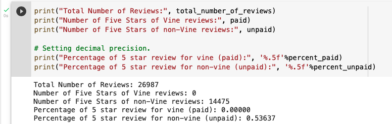

# Amazon Vine Analysis

References:

How to use groupby with aggregation: [pyspark.sql.DataFrame.groupBy](https://spark.apache.org/docs/latest/api/python/reference/api/pyspark.sql.DataFrame.groupBy.html)

Decimal precision: [precision Handling in Python
](https://www.geeksforgeeks.org/precision-handling-python/)

---

### Overview of the analysis: Explain the purpose of this analysis.
- The purpose of this analysis is to demonstrate ETL process by extracting, transforming, connecting to AWS RDS instance, and loading transformed data into pgAdmim (postgreSQL). Analysis is then followed by identifying if there is existing bias toward favorable reviews from Vine members in the dataset. 

### Results: Using bulleted lists and images of DataFrames as support, address the following questions:

- How many Vine reviews and non-Vine reviews were there?
  - Total Number of Reviews: 26987

- How many Vine reviews were 5 stars? How many non-Vine reviews were 5 stars?
  - Number of Five Stars of Vine reviews: 0
  - Number of Five Stars of non-Vine reviews: 14475 

- What percentage of Vine reviews were 5 stars? What percentage of non-Vine reviews were 5 stars?
  - Percentage of 5 star review for vine (paid): 0.00000
  - Percentage of 5 star review for non-vine (unpaid): 0.53637

Supporting image for reference:

### Summary: In your summary, state if there is any positivity bias for reviews in the Vine program. Use the results of your analysis to support your statement. Then, provide one additional analysis that you could do with the dataset to support your statement.
- There is no positivity bias for reviews in the Vine program. As indicated in the analysis, there is no evident showing there is any bias toward 5 star reviews from Vine members.  
- An additional, and more in-depth analysis would be to find out the distribution of star ratings for Vine members, vs non-Vine members. 